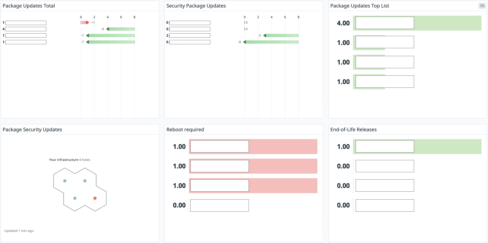

# Package Updates DataDog agent Plugin

This plugin sends metrics regarding package updates and reboot status
to a DataDog instance.



```console
Work in progress.
```

If `/usr/lib/update-notifier/apt_check.py` is available, the output will be used
to set `system.package.updates` and `system.package.updates.security`.

If `/var/run/reboot-required` is present, `system.reboot.required` will be set
to `1`.

If `lsb_release` is available and the distribution is [Ubuntu](https://ubuntu.com/),
the release number will be used to calculate if the release if end-of-life and
`system.release.eol` will be set.

## Metrics

[https://docs.datadoghq.com/metrics/agent_metrics_submission/?tab=gauge](https://docs.datadoghq.com/metrics/agent_metrics_submission/?tab=gauge)

```console
system.package.updates
system.package.updates.security
system.reboot.required
system.release.eol
```

## Files

```console
/etc/datadog-agent/checks.d/package_updates.py
/etc/datadog-agent/conf.d/package_updates.d/package_updates.yaml
```

## Installation example

```sh
git clone https://github.com/konstruktoid/datadog-package-updates
cd datadog-package-updates/
sudo cp -vnR checks.d/ conf.d/ /etc/datadog-agent/
sudo chown -R dd-agent:dd-agent /etc/datadog-agent/conf.d/package_updates.d/
sudo chown -R dd-agent:dd-agent /etc/datadog-agent/checks.d/package_updates.py
sudo systemctl restart datadog-agent
```
